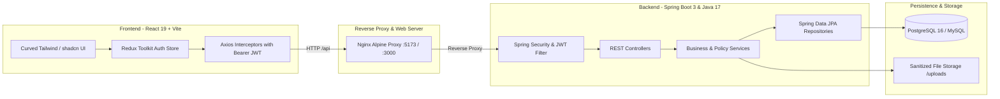

# ResolveDesk — Smart Campus Grievance Redressal System (SGS)

A production-grade, enterprise **college campus grievance redressal and complaint management platform** designed for higher education institutions (modeled after UGC/AICTE Grievance Redressal guidelines). Built to ensure transparent, auditable, and accountable issue resolution between **Students**, **Department Grievance Officers**, and **College Administrators**.

Students lodge campus complaints across institutional departments (*Hostel & Accommodation, Academics & Examinations, IT & Infrastructure, Canteen & Mess, Administration*), track them in real time with an immutable audit timeline, and rate resolution outcomes — while officers and administrators triage, assign, investigate, and resolve tickets through role-scoped workflows with SLA breach tracking.

Built with **Spring Boot 3 (Java 17, Spring Security + JWT, Spring Data JPA, PostgreSQL / H2)** on the backend and **React 19 (Vite, Tailwind CSS, shadcn/Radix UI, Redux Toolkit)** on the frontend, fully containerized with **Docker & Docker Compose**.

---

## 📍 System Capabilities & Recent Advancements

* ✅ **Institutional Access Model & Domain Verification** — Student onboarding gated strictly to college domain emails (`@anits.edu.in`) with 6-digit cryptographic OTP code verification. Open self-registration for staff is disabled.
* ✅ **Staff & Officer Invitation System** — Department Grievance Officers and Administrators join exclusively through secure, one-time invitation tokens generated by the Administrator (`/accept-invite`).
* ✅ **Three Scoped Role Portals** — Custom-tailored workflows and navigation for **Students**, **Department Officers**, and **System Administrators**.
* ✅ **Full Grievance Lifecycle State Machine** — `PENDING ➔ ASSIGNED ➔ IN_PROGRESS ➔ RESOLVED / REJECTED` plus `CLOSED_BY_USER`, enforced with server-side transition checks and an immutable audit trail in `grievance_history`.
* ✅ **Officer Departmental Queue & Resolution Drawer** — Department-bound 3-tab queue (*Department Pool / My Active Workload / Resolved History*), one-click *"Accept & Start"*, and a resolution modal with mandatory remarks.
* ✅ **Admin Command Center** — Campus-wide KPI analytics, Recharts workload breakdown, SLA escalation warnings, department management, and direct officer assignment.
* ✅ **Modern Curved UI & ANITS Paper/Ink Design System** — Cohesive visual identity:
  * Curated institutional palette: Ink (`#1C2024`), Paper (`#FAF9F6`), Deep Forest Accent (`#2B5D4F`), Amber (`#B8862E`), and Green (`#3F6B4A`).
  * Consistent curved border hierarchy: `rounded-3xl` for modals and main containers, `rounded-2xl` for sub-cards and metric blocks, `rounded-xl` for inputs/buttons, and `rounded-full` for status badges.
* ✅ **Comprehensive Profile Hub** — Integrated student/staff identity page with personal grievance metrics (*Total, In-Progress, Resolved, Under Review*), academic credentials (*Roll ID, Department*), recent grievance history log, and clean tabbed forms for editing contact info and updating passwords.
* ✅ **Evidence Attachments & Download Protection** — 5 MB upload ceiling with strict MIME/extension allowlists (JPEG, PNG, PDF), stored under unique UUIDs with path-traversal protection.
* ✅ **Privacy-by-Default Architecture** — Case details and evidence are restricted strictly to the ticket author, assigned officer, and administrators. Internal investigative notes remain hidden from students.
* ✅ **Async Notification Engine** — Spring `@Async` email service with automatic dev-mode console simulation when live SMTP is omitted.
* ✅ **Production Docker Stack** — Ready-to-deploy multi-container environment with Nginx reverse proxy, Spring Boot 3 API, and PostgreSQL 16 with automated health checks.

---

## 🏗️ System Architecture



---

## 🔄 Grievance Lifecycle & SLA Validation

Statuses are enforced centrally in `GrievanceService.ALLOWED_TRANSITIONS`. Any illegal transition is rejected with HTTP `400 Bad Request`:

```text
               ┌──────────────┐
               │   PENDING    │ (Student lodged, in Department Pool)
               └──────┬───────┘
                      │
               ┌──────▼───────┐
               │   ASSIGNED   │ (Officer assigned / picked up)
               └──────┬───────┘
                      │
               ┌──────▼───────┐
               │ IN_PROGRESS  │ (Investigation underway)
               └──────┬───────┘
                      │
         ┌────────────┴────────────┐
         ▼                         ▼
  ┌──────────────┐          ┌──────────────┐
  │   RESOLVED   │          │   REJECTED   │
  └──────────────┘          └──────────────┘
  (Mandatory remarks)       (Mandatory remarks)
```

* **SLA Priority Windows**:
  * **HIGH**: 7 days resolution window.
  * **MEDIUM**: 15 days resolution window.
  * **LOW**: 30 days resolution window.
* Tickets remaining active past their SLA deadline automatically trigger **SLA Breach Warnings** across officer and administrator dashboards.

---

## 👥 User Roles & Access Control

### 1. 🎓 Student (`ROLE_USER`)
* **Registration with College OTP**: Verify official `@anits.edu.in` email via 6-digit OTP before account creation.
* **Lodge Grievance**: Select campus department, assign priority, describe the incident, and attach evidence.
* **Live Case Audit Timeline**: Track status changes, assigned officers, and resolution notes.
* **Campus Community Feed**: View and upvote published issues for broader administrative visibility.
* **Profile & Identity Hub**: View personal complaint metrics, institutional roll number, and manage security credentials.

### 2. 👮 Department Grievance Officer (`ROLE_OFFICER`)
* **Department-Bound Scoping**: Officers only view and process tickets belonging to their assigned academic department.
* **Workload Triage**:
  * *Department Pool*: Unassigned tickets awaiting pickup (*Accept & Start*).
  * *My Active Tasks*: In-progress investigations assigned to the officer.
  * *Resolved History*: Past resolved cases with resolution notes and student ratings.
* **Resolution Drawer**: Submit official resolution or rejection remarks with mandatory justification.

### 3. 🔑 System Administrator (`ROLE_ADMIN`)
* **Campus Oversight Dashboard**: Real-time KPI counters, department workload distribution, and resolution trend charts.
* **Staff Invitations**: Generate secure invitation links for new faculty and departmental officers.
* **Direct Ticket Assignment**: Reassign tickets directly to specific officers or override priority levels.
* **Department Management**: Add, update, or deactivate college departments.

---

## 🏫 Campus Seed Data & Demo Accounts

On startup (under the `dev` profile), the system automatically provisions 5 official campus departments and demo accounts:

| Role | Username | Password | Assigned Department | Purpose |
| :--- | :--- | :--- | :--- | :--- |
| **Admin** | `admin12` | `admin1234` | System-wide | Global analytics, staff invites & system config |
| **Officer** | `officer1` | `officer1234` | Hostel & Accommodation | Hostel rooms, mess, maintenance |
| **Officer** | `officer2` | `officer1234` | Academics & Examinations | Exam schedules, grading, faculty inquiries |
| **Officer** | `officer3` | `officer1234` | IT & Infrastructure | Campus Wi-Fi, lab equipment, portal issues |
| **Officer** | `officer4` | `officer1234` | Canteen & Mess | Food quality, hygiene, catering service |
| **Officer** | `officer5` | `officer1234` | Administration | ID cards, certificates, fee receipts |
| **Student** | *(self-register)* | *(your password)* | N/A | Submit complaints via college OTP verification |

---

## 🚀 Quick Start with Docker Compose

The fastest way to run the complete production-ready stack (Frontend + Backend + PostgreSQL):

```bash
# 1. Clone repository
git clone <repo-url>
cd ResolveDesk-Smart-Grievance-System

# 2. Launch all services
docker compose up --build -d
```

### Access URLs:
* **Frontend Application**: `http://localhost:5173` (or `http://localhost:3000`)
* **Backend REST API**: `http://localhost:8081`
* **Swagger API Documentation**: `http://localhost:8081/swagger-ui.html`
* **PostgreSQL Database**: `localhost:5432` (Database: `smart_grievance_db`, User: `postgres`)

---

## 🛠️ Local Development Setup

### Backend (Spring Boot 3)
```bash
cd Backend
./mvnw clean compile
./mvnw spring-boot:run -Dspring-boot.run.profiles=dev
```
* Runs on `http://localhost:8081`.
* All 37 automated tests passing: `./mvnw test`.

### Frontend (React 19 + Vite)
```bash
cd Frontend
npm install
npm run dev
```
* Runs on `http://localhost:5173` with reverse proxy to backend.
* Run tests: `npm test`.
* Production build: `npm run build`.

---

## 📡 API Reference Overview

Base URL: `http://localhost:8081` — full interactive OpenAPI documentation available at [`/swagger-ui.html`](http://localhost:8081/swagger-ui.html).

### 🔐 Authentication & Access — `/api/auth`
| Method | Endpoint | Access | Description |
| :--- | :--- | :--- | :--- |
| `POST` | `/api/auth/register` | Public | Register student (validates college domain & issues OTP) |
| `POST` | `/api/auth/verify-otp` | Public | Verify 6-digit OTP and complete registration |
| `POST` | `/api/auth/login` | Public | Authenticate with username/password & receive JWT |
| `POST` | `/api/auth/accept-invite` | Public | Complete officer/admin onboarding via token |

### 📝 Grievances & Complaints — `/api/grievances`
| Method | Endpoint | Access | Description |
| :--- | :--- | :--- | :--- |
| `GET` | `/api/grievances/departments` | USER | List active campus departments |
| `POST` | `/api/grievances` | USER | Lodge new grievance (`multipart`: payload + evidence) |
| `GET` | `/api/grievances/my` | USER | List complaints lodged by current user |
| `GET` | `/api/grievances/{id}` | Authorized | Detailed case view with evidence |
| `GET` | `/api/grievances/{id}/history` | Authenticated | Chronological audit trail |
| `PUT` | `/api/grievances/{id}/accept` | OFFICER, ADMIN | Accept department-pool ticket (➔ `IN_PROGRESS`) |
| `PUT` | `/api/grievances/{id}/status` | OFFICER, ADMIN | Resolve or reject ticket with mandatory remarks |
| `PUT` | `/api/grievances/{id}/close` | USER | Close own ticket (`CLOSED_BY_USER`) |

### 👤 Profile & User Settings — `/api/user`
| Method | Endpoint | Access | Description |
| :--- | :--- | :--- | :--- |
| `GET` | `/api/user/profile` | Authenticated | Retrieve current user profile & academic credentials |
| `PUT` | `/api/user/profile` | Authenticated | Update contact phone, address, and personal info |
| `PUT` | `/api/user/change-password` | Authenticated | Update authentication passphrase |

### 🏛️ Administrator Operations — `/api/admin`
| Method | Endpoint | Access | Description |
| :--- | :--- | :--- | :--- |
| `POST` | `/api/admin/staff/invite` | ADMIN | Generate cryptographic staff invitation |
| `GET` / `POST` | `/api/admin/departments` | ADMIN | Department management |
| `POST` | `/api/admin/grievances/{id}/assign/{officerId}` | ADMIN | Assign ticket directly to an officer |
| `GET` | `/api/admin/users` | ADMIN | Paginated user directory with role toggle |

---

## 🔒 Security & Privacy Highlights

1. **Role-Based Access Control (RBAC)**: Enforced across REST endpoints using Spring Security `@PreAuthorize("hasRole(...)")`.
2. **Sanitized Evidence Storage**: Evidence attachments checked against strict file headers, limited to 5 MB, stored with UUIDs, and served with sanitization to prevent path-traversal exploits.
3. **No Hardcoded Secrets**: Production configuration is entirely environment-variable driven.
4. **Audit Trail**: Every change of status, officer assignment, or resolution remark is permanently recorded with user identity and timestamp.

---

## 📁 Repository Structure

```text
ResolveDesk-Smart-Grievance-System/
├── Backend/
│   ├── src/main/java/com/grievance/
│   │   ├── config/          # Security, DataInitializer, CORS & FileStorage config
│   │   ├── controller/      # REST Controllers (Auth, Grievance, Officer, Admin, User)
│   │   ├── dto/             # Request & Response DTOs with validation rules
│   │   ├── entity/          # JPA Entities (User, Grievance, Department, History, OtpCode, InviteToken)
│   │   ├── enums/           # GrievanceStatus, Priority, Role
│   │   ├── exception/       # GlobalExceptionHandler and typed error handling
│   │   ├── repository/      # Spring Data JPA Repositories
│   │   ├── security/        # JWT Authentication, token provider & user details
│   │   └── service/         # Business logic, email dispatch & file storage
│   ├── src/main/resources/  # Application properties & SQL migration scripts
│   ├── pom.xml              # Maven dependencies & build definitions
│   └── Dockerfile           # Backend containerization (Java 17 Temurin)
│
├── Frontend/
│   ├── src/
│   │   ├── components/      # UI primitives, Admin dialogs, Navbar, Footer
│   │   ├── lib/             # Axios API client, privacy helpers & utilities
│   │   ├── pages/           # ProfilePage (Hub), Dashboard, NewGrievance, GrievanceDetails,
│   │   │                    # RecentGrievances, MyGrievances, Login, Register, AcceptInvite
│   │   ├── store/           # Redux Toolkit authentication slices
│   │   └── index.css        # ANITS paper/ink color tokens & typography
│   ├── nginx.conf           # Reverse proxy and client routing rules
│   ├── Dockerfile           # Multi-stage production build (Node 20 -> Nginx Alpine)
│   └── package.json         # React 19, Tailwind CSS, Vite scripts
│
├── docker-compose.yml       # Production multi-service orchestration
└── README.md                # Comprehensive documentation
```

---

## 🛡️ License
Distributed under the **MIT License**. Created for academic and institutional campus grievance redressal.
